# Unified Data Model and Knowledge Graph

<!-- _class: title-slide -->

Connecting software names and metadata to archived source

Andrew Nesbitt · ecosyste.ms

CodeCommons · 28 September 2026

<!--
0:00

On screen before speaking starts.
-->

---

# Andrew Nesbitt

<!-- _class: intro -->

I build **ecosyste.ms**: APIs and datasets about packages, repositories and dependencies.

I work with **Alpha-Omega** on open-source security, and with **OpenAlex** and **UT Austin** on connecting research papers to the software they cite.

I'm a package management nerd and write about it at [nesbitt.io](https://nesbitt.io/about/).

  

<!--
0:45

- ecosyste.ms
- Alpha-Omega security work
- OpenAlex/UT Austin research-software grant
-->

---

# Ecosyste.ms

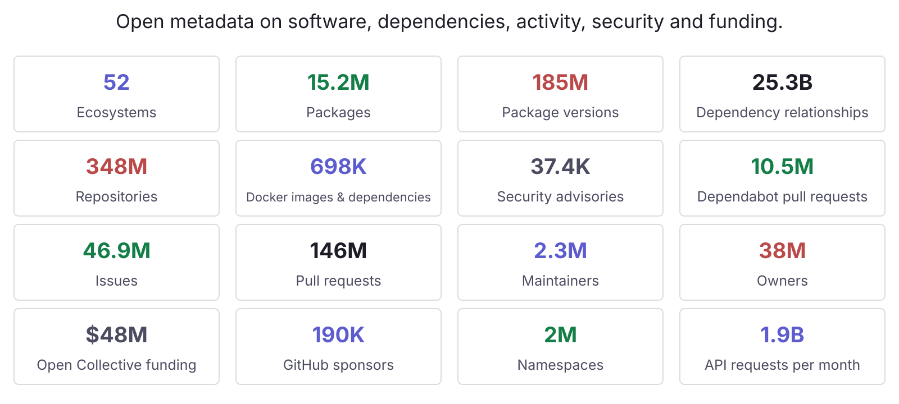

<!--
0:45

Repository URLs and package IDs join these datasets.

Counts overlap; don't add them. Sponsor counts aren't funding amounts.
-->

---

<!-- _class: registry-slide -->

# Package registries

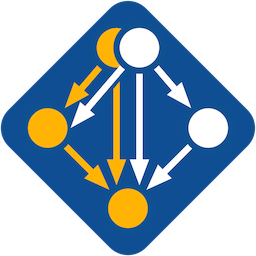

<!--
0:30

Each registry has its own naming and version rules.

Several distribution releases share an avatar; image count differs from registry count.
-->

---

# Dependencies

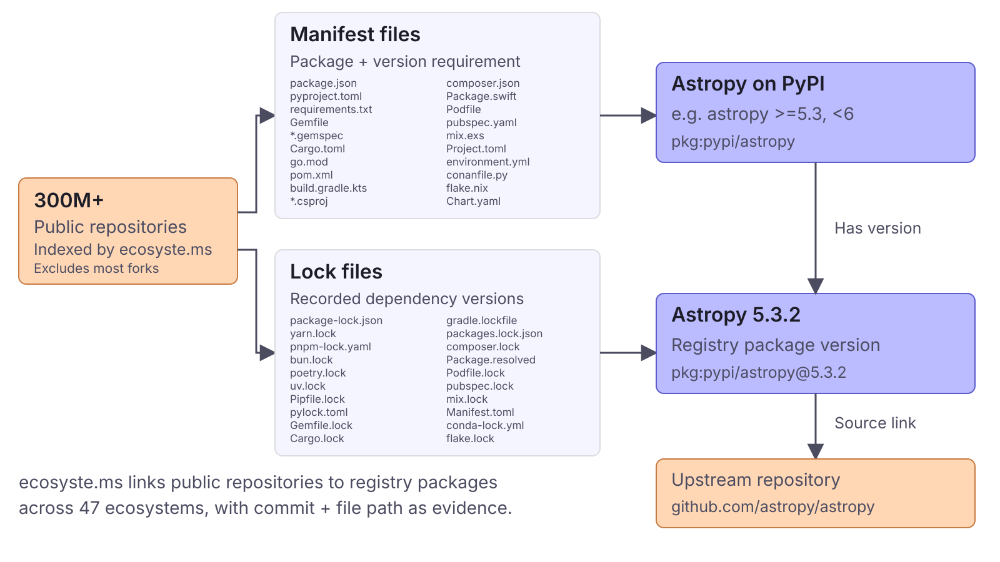

<!--
1:00

25B+ dependency links recorded.

Keep commit + file path so each relationship can be checked against archived source.

SWH's documented API doesn't expose a resolved package dependency graph.
-->

---

# SBOMs

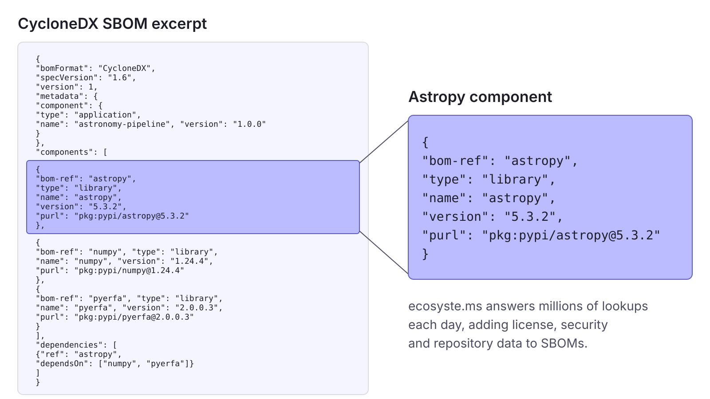

<!--
1:00

Astropy: community-developed astronomy software.

Enrichment starts with a purl; the missing step is tracing it to archived source.
-->

---

# packages.ecosyste.ms

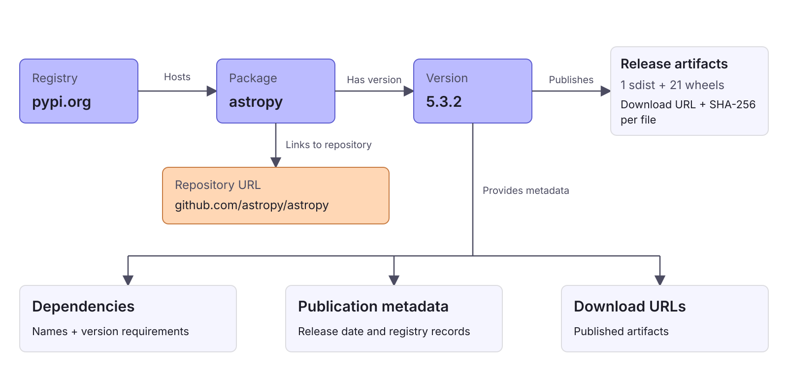

<!--
3:00

Adapter per registry; feeds + forge events + sweeps keep records current.

One Rails service per concern, own Postgres, HTTP between them.

Shared upstream helps connect registries. Check version mappings and downstream backports.
-->

---

# repos.ecosyste.ms

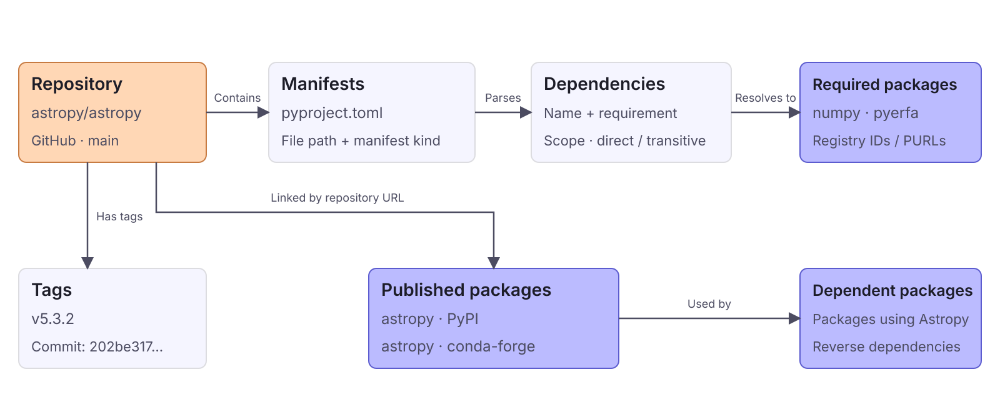

<!--
2:00

Default-branch manifests don't establish a release's dependencies; parse the tag separately.

One repository can publish several packages with different dependency sets.
-->

---

# advisories.ecosyste.ms

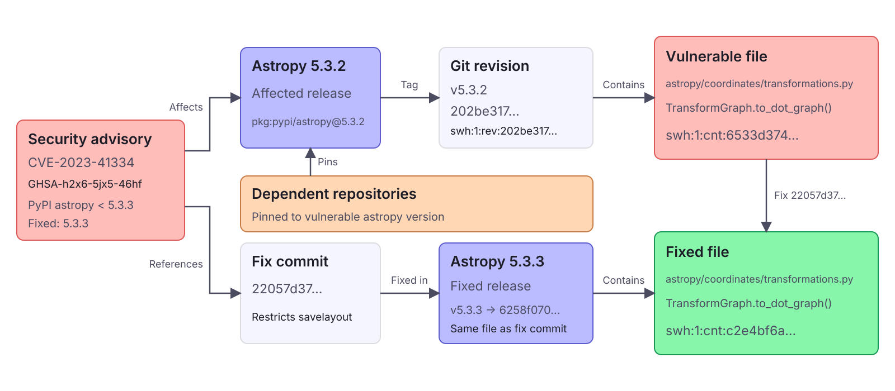

<!--
2:00

Verified before/after file bytes connect the fix to these releases.

A pin indicates potential exposure; exploitability depends on use.

Content SWHIDs calculated locally; archive presence still needs checking.
-->

---

# science.ecosyste.ms

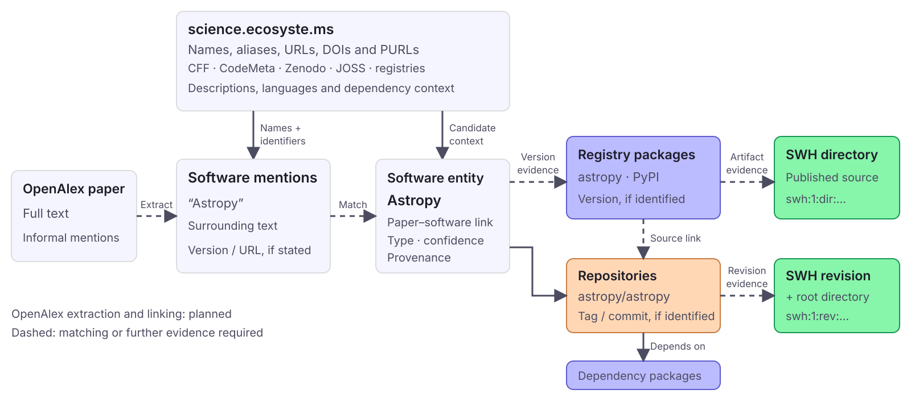

<!--
2:00

A software-paper citation alone doesn't establish software use.

Science's current SWH scans cover default-branch checkouts; they can't establish which version a paper used.

These links could support software credit and adoption metrics.
-->

---

<!-- _class: triangle-slide -->

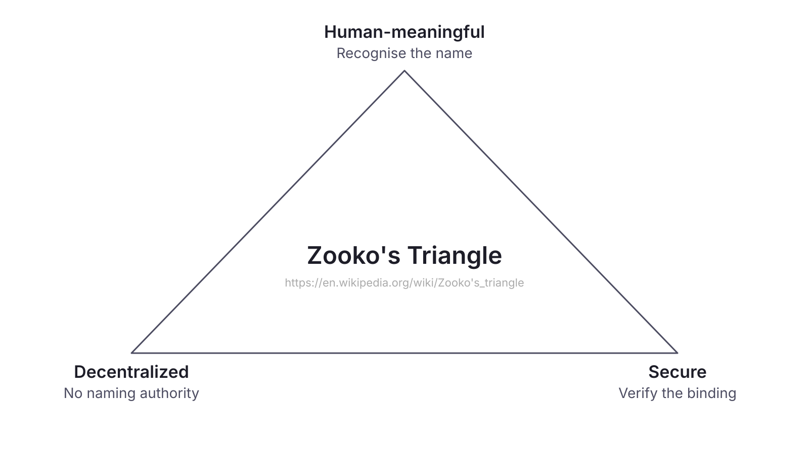

<!--
1:00

Naming is hard; Zooko Wilcox-O'Hearn, 2001. Pick two.

Classic examples: DNS names, content hashes, petnames.

Package management hits this daily.
-->

---

<!-- _class: triangle-slide -->

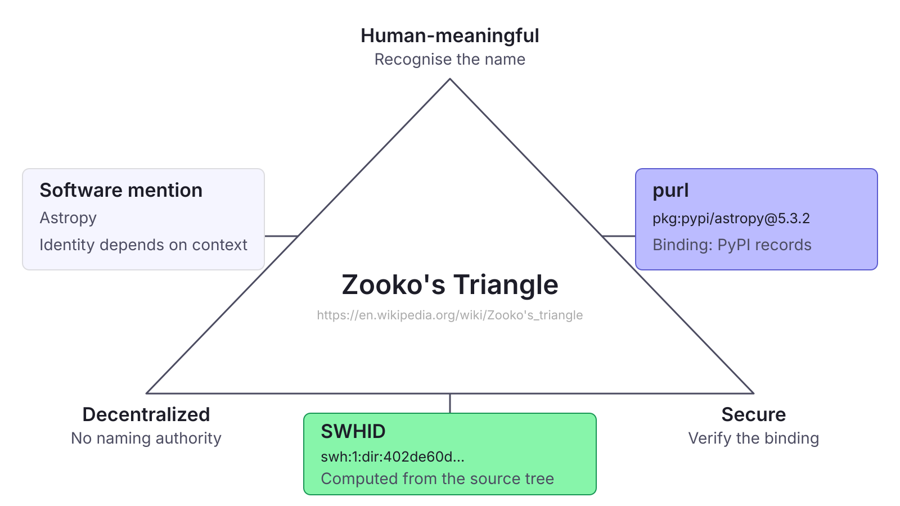

<!--
1:00

A mention is meaningful but unverifiable,

a purl is meaningful and verifiable but only via the registry's authority,

a SWHID is verifiable and authority-free but means nothing to a human,

and the graph exists so you can walk between the three.
-->

---

# Package to Archive

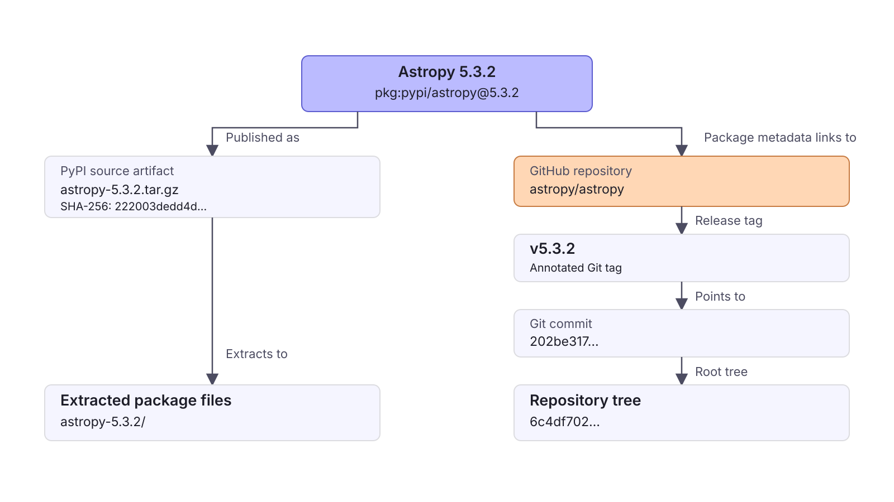

<!--
2:00

Repository URLs can be wrong; tags are conventions. Verify both.

Packaging can add or omit files, so the published tree can differ from Git.
-->

---

# Package to Archive

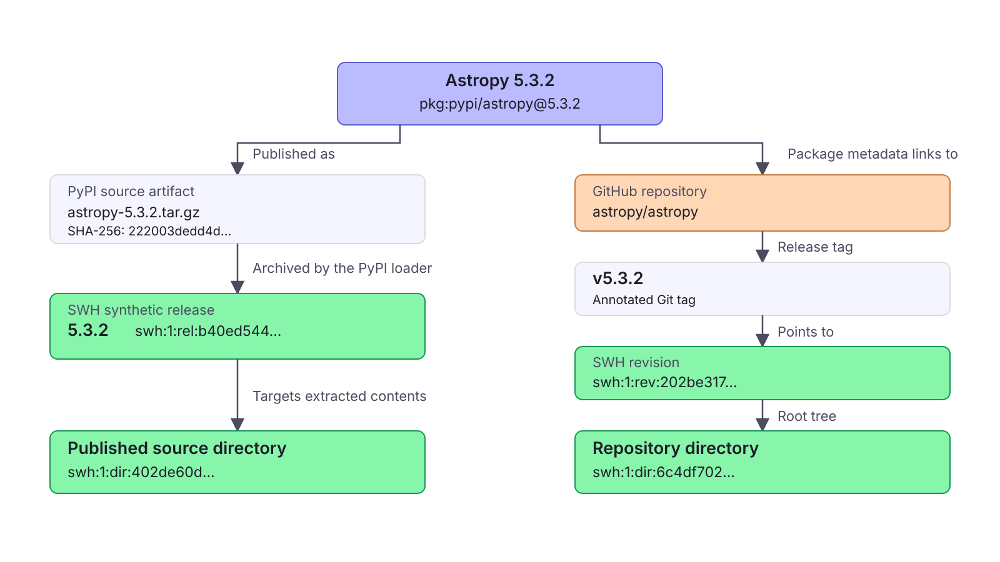

<!--
2:30

The directories still differ after removing the archive's wrapper folder.

Return both with evidence so callers can choose. Wheels remain a separate preservation question.
-->

---

# Shared Content Addresses

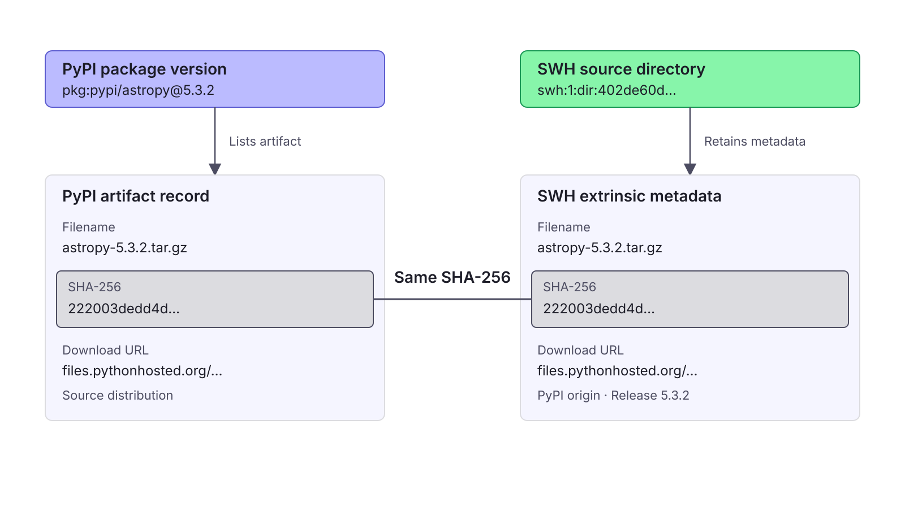

<!--
2:00

SWH retains authority + fetcher + discovery date; ecosyste.ms indexes by purl.

CodeCommons ask: make this join queryable from the package side.
-->

---

# Unified Data Model

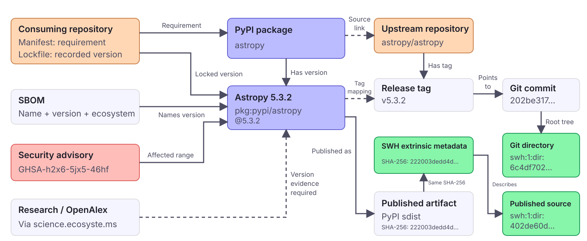

<!--
1:30

Each relationship needs its source and date; bindings change.

CodeCommons could maintain these mappings and expose verifiable paths to archived source.
-->

---

# Thank You · Q/A

<!-- _class: closing-slide -->

Andrew Nesbitt · andrew@ecosyste.ms

- [ecosyste.ms](https://ecosyste.ms/)
- [science.ecosyste.ms](https://science.ecosyste.ms/)
- [nesbitt.io](https://nesbitt.io/)

@andrew@mastodon.social

<!--
0:00

Left on screen during the ~10 minutes of questions.

Likely first question is "how does ecosyste.ms actually work under the hood":

one Rails service per concern, own Postgres, HTTP between them,

adapter per registry, everything joined on repository_url.
-->
